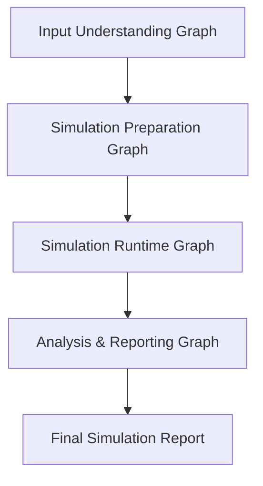
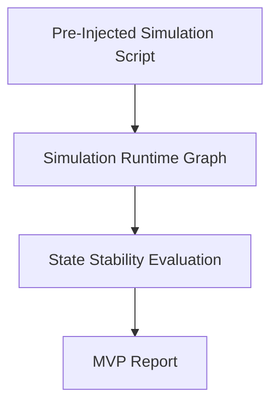
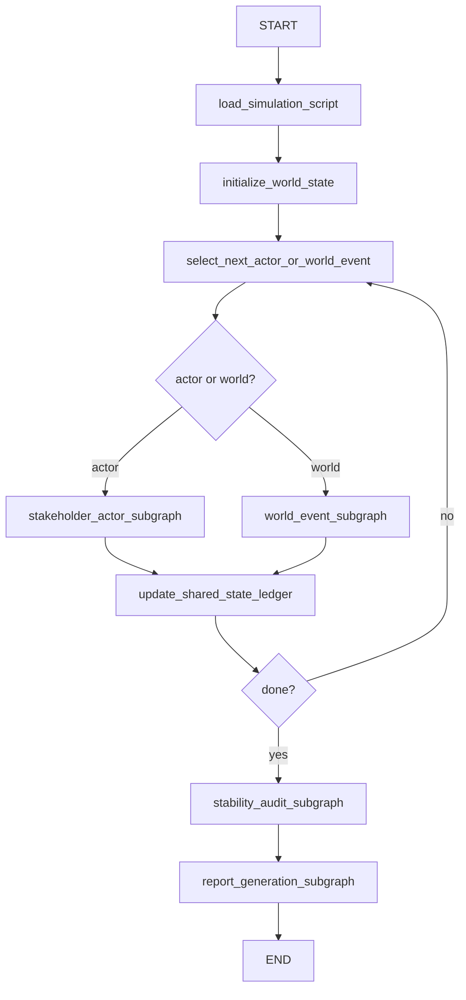
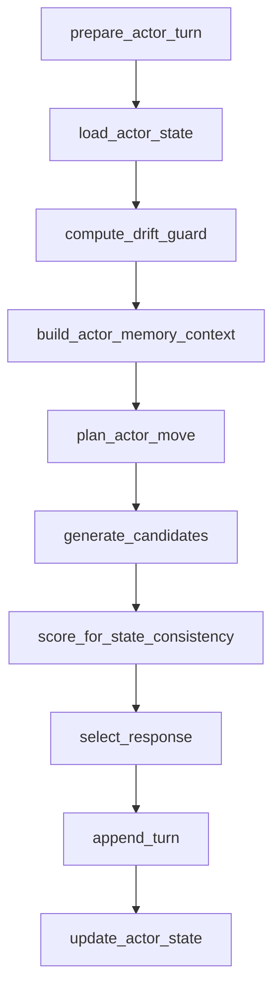

# LangGraph Product Architecture for the Simulation Engine

Date: 2026-03-06 13:57

## 1. What The End Product Actually Is

The end product is not a personality experiment runner.

It is a simulation engine that:

1. accepts an uploaded artifact such as a report, memo, policy brief, or issue summary
2. infers the simulation objective, target population, adjacent stakeholders, and likely interaction surface
3. builds a stakeholder map and a simulation script
4. runs a multi-stakeholder simulation with persistent persona state
5. produces an analysis report explaining likely impacts, tensions, spillovers, and failure modes

Example:

- user uploads a report about `정책 A가 대한민국 20-40대 청년들에게 끼칠 영향`
- engine reads the stated target population, intended benefits, implementation assumptions, and possible spillovers
- engine expands the stakeholder map beyond the explicit target:
  - 20-40 youth
  - 50-60 local merchants
  - employers
  - local administrators
  - landlords or service providers if second-order exposure matters
- engine simulates interactions among those stakeholders
- engine outputs a report about direct effects, indirect effects, conflicts, consensus patterns, and uncertainty

That is the product target.

## 2. Where The Current LangGraph Work Fits

The current LangGraph implementation in this repo is not the full end product.

It is the `simulation runtime kernel` for one controlled discussion loop.

What it does well:

- isolates planning, generation, scoring, selection, memory, and audit into explicit nodes
- separates deterministic control from LLM generation
- makes state artifacts first-class instead of hiding them in one big procedural loop

What it does not do yet:

- document ingestion
- automatic stakeholder discovery
- indirect stakeholder expansion
- world/script generation from uploaded input
- symmetric multi-stakeholder simulation where every actor is a first-class entity
- impact-report generation grounded in stakeholder outcomes instead of trait elicitation

So the right framing is:

- current LangGraph = useful core
- end product = broader product architecture that wraps this core

## 3. Product Architecture

The product should be split into four layers.



### 3.1 Input Understanding Graph

Purpose:

- understand the uploaded artifact
- extract the stated target, purpose, constraints, and claimed mechanism
- identify direct and indirect stakeholders
- build an initial stakeholder map and causal hypothesis map

Core nodes:

1. `ingest_document`
2. `extract_goal_and_scope`
3. `extract_claims_and_mechanisms`
4. `discover_primary_stakeholders`
5. `expand_adjacent_stakeholders`
6. `build_causal_surface`
7. `draft_simulation_brief`

Output:

- simulation objective
- target population
- stakeholder candidates
- interaction hypotheses
- uncertainty flags

### 3.2 Simulation Preparation Graph

Purpose:

- convert the understanding layer into a runnable simulation script
- create persona cards and initial state for each stakeholder
- define events, interaction rules, and scenario phases

Core nodes:

1. `select_stakeholders_for_run`
2. `build_persona_cards`
3. `separate_identity_from_dynamic_state`
4. `define_world_events`
5. `define_phase_schedule`
6. `compile_actor_contracts`
7. `emit_simulation_script`

Output:

- stakeholder roster
- per-stakeholder identity
- per-stakeholder personality prior
- initial emotional / relational state
- scenario phases
- event schedule

### 3.3 Simulation Runtime Graph

Purpose:

- run the interaction itself
- preserve persona stability while allowing bounded influence
- update relationships and commitments
- keep world events and turn routing coherent

This is the layer most directly related to the current BCFC LangGraph work.

### 3.4 Analysis & Reporting Graph

Purpose:

- aggregate transcripts and state traces
- explain what happened and why
- summarize direct effects, indirect effects, disagreements, stable consensus, and unresolved uncertainty

Core nodes:

1. `aggregate_state_traces`
2. `extract_outcomes_per_stakeholder`
3. `extract_conflict_and_consensus_clusters`
4. `derive_impact_hypotheses`
5. `generate_report`
6. `generate_supporting_tables`

Output:

- final narrative report
- stakeholder-level summaries
- evidence snippets
- uncertainty and caveat section

## 4. What The MVP Actually Needs To Prove

The MVP does **not** need to prove the full product.

The MVP does **not** need automated input understanding or automated simulation preparation.

For MVP, those layers can be replaced by pre-injected scripts.

The MVP needs to prove one thing:

> when the same simulation is run with naive prompting versus with the engine, the engine keeps AI persona states more stable under interaction pressure

That means the primary product claim is not:

- "we can parse any document"

It is:

- "our runtime keeps stakeholder personas, attitudes, and relationships coherent better than naive prompting"

## 5. MVP Scope

For MVP:

- `Input Understanding Graph` can be manual or semi-manual
- `Simulation Preparation Graph` can be manual or semi-manual
- `Simulation Runtime Graph` must be real
- `Analysis & Reporting Graph` can be narrower, as long as it can support the stability claim

Practical MVP pipeline:



The pre-injected script should include:

- scenario brief
- stakeholder roster
- each stakeholder's stable identity
- each stakeholder's personality prior
- initial beliefs / concerns / incentives
- initial relationships
- phase schedule
- external events

## 6. The Most Important Thing To Validate

The single most important thing to validate is:

`persona state stability under interaction`

This breaks into four testable sub-claims.

### 6.1 Personality Stability

Question:

- does each stakeholder stay near its intended personality prior over the course of the simulation?

Failure mode:

- all actors converge into the same agreeable, generic LLM voice
- a cautious actor becomes overly assertive after a few turns
- a creative actor loses novelty after conflict pressure

### 6.2 Interaction Stability

Question:

- do relationships and commitments evolve consistently instead of resetting or oscillating arbitrarily?

Failure mode:

- actor A praises actor B, then abruptly attacks them without a state transition
- actor C promises an action, then ignores it without explanation
- alliances and tensions do not persist across turns

### 6.3 Bounded Influence

Question:

- can stakeholders be influenced without losing core identity?

Failure mode:

- persuasion causes identity collapse instead of controlled update
- every actor eventually mirrors the loudest participant

This is critical because your product is specifically about interaction-driven change with stable cores.

### 6.4 Cross-Run Repeatability

Question:

- if the same script is run multiple times, does the engine reduce variance relative to naive prompting?

Failure mode:

- one run looks plausible, but repeated runs drift wildly in persona behavior or outcome

## 7. Recommended MVP Benchmark

### 7.1 Baseline

Use a naive prompting baseline:

- one system prompt per actor
- plain conversation history
- no contract controller
- no explicit persona-state ledger
- no structured relationship or commitment memory
- no selection controller

This is the baseline the engine must beat.

### 7.2 Treatment

Use the engine:

- per-actor contract
- planner/generator split
- memory-backed selection
- relationship and commitment state
- bounded drift control
- deterministic scoring and selection

### 7.3 Hold Constant

To keep the comparison honest, hold these fixed:

- base LLM family when possible
- temperature policy
- scenario script
- number of actors
- event schedule
- number of turns

### 7.4 MVP Success Criteria

Recommended primary success criteria:

1. lower trait drift than naive prompting
2. lower relationship inconsistency than naive prompting
3. lower commitment contradiction than naive prompting
4. lower cross-run variance than naive prompting
5. no major regression in naturalness / coherence

## 8. Metrics To Use For Validation

The repo already contains useful pieces for this.

### 8.1 Metrics To Reuse Directly

From the current codebase:

- `evaluate_group_session()` for inferred Big Five vector
- `score_commitment_continuity()` for commitment persistence
- `detect_commitment_contradiction()` for contradiction checks
- `score_relationship_consistency()` for relationship persistence
- `compute_contradiction_rate()` for obvious self-reversal
- `compute_direct_question_answer_rate()` for responsiveness
- `compute_over_verbosity_rate()` for generic bloating

Relevant code already exists in:

- `evaluation/trait_evaluator.py`
- `experiment/memory_backend.py`
- `experiment/trajectory_metrics.py`

### 8.2 New Metrics Needed For MVP

The current repo is candidate-centric, so MVP needs some simulation-specific metrics.

#### A. Persona Drift MAE

For each stakeholder:

- infer personality at turn windows or phase windows
- compare against the actor's initial contract
- compute mean absolute error

This should be the headline metric.

#### B. Interaction Consistency Score

For each stakeholder pair:

- compare current stance toward counterpart with prior relationship state
- reward smooth transitions
- penalize unexplained flips

#### C. Identity Persistence Score

Check whether each stakeholder keeps:

- role
- core incentive
- risk posture
- framing priorities

This is different from pure Big Five stability.

#### D. Cross-Run Variance

Run the same script multiple times and measure:

- trait variance
- relationship variance
- outcome variance

If the engine is working, variance should shrink meaningfully.

### 8.3 Secondary Guardrail Metrics

Do not let the engine win by becoming robotic.

Track:

- coherence
- responsiveness
- contradiction rate
- over-verbosity
- diversity of candidate options

## 9. Why Input Understanding Is Not The First MVP Risk

Input understanding matters for the full product, but it is not the first proof point.

Reason:

- if the runtime cannot keep personas stable, better document parsing does not rescue the product
- if the runtime does keep personas stable, pre-injected scripts are enough to demonstrate the core value

Therefore the correct MVP sequence is:

1. prove runtime stability
2. prove runtime stability in policy-style scripts
3. then automate script generation from uploaded documents

## 10. How The Current Code Architecture Can Be Leveraged

The current repo is more reusable than it first appears.

### 10.1 `ExperimentCandidateAgent` -> `StakeholderActor`

Current role:

- latent plan generation
- surface candidate generation

Reuse plan:

- generalize from a single `Candidate` to any actor
- keep the planner/generator split
- instantiate one actor controller per stakeholder

This is a strong reusable core.

### 10.2 `FidelityController` -> `PersonaStateController`

Current role:

- drift checks
- constraint scoring
- candidate scoring
- selection control

Reuse plan:

- keep the core logic
- instantiate one controller per stakeholder
- reinterpret contracts as stakeholder persona contracts

This is the main mechanism for the MVP claim.

### 10.3 `InMemoryBackend` -> `SimulationStateLedger`

Current role:

- commitments
- relationships

Reuse plan:

- change from single-speaker support to multi-stakeholder keyed state
- keep commitments and relationships
- add:
  - beliefs
  - concerns
  - trust
  - stress
  - salience of issues

This is the minimum state ledger needed for persona stability claims.

### 10.4 `GroupEngine` + `Moderator` -> `WorldEngine` + `Orchestrator`

Current role:

- fixed group discussion loop
- turn routing
- pressure injection

Reuse plan:

- preserve the turn scheduler pattern
- remove the assumption that only one actor is fidelity-controlled
- change the objective from `trait elicitation` to `stakeholder interaction management`

This part should be reused structurally, not semantically.

### 10.5 `trait_evaluator` + `trajectory_judge` -> `Offline Stability Audit`

Current role:

- offline assessment
- ensemble judge

Reuse plan:

- keep them in the audit path
- retarget them to evaluate stakeholder stability and transcript coherence
- do not put these heavy judges in the online loop

### 10.6 Current LangGraph Skeleton -> Product Runtime Graph

Current useful subgraphs:

- actor subgraph
- environment subgraph
- post-session audit subgraph

Reuse plan:

- actor subgraph becomes reusable per stakeholder
- environment subgraph becomes world-event orchestrator
- audit subgraph becomes stability evaluator and report builder

## 11. What Must Change In The Current Architecture

There are three major asymmetries in the current code that must change.

### 11.1 Candidate vs Environment Asymmetry

Right now:

- one actor is protected
- other actors are elicitation devices

Product version needs:

- all important stakeholders are first-class actors
- each actor gets:
  - stable identity
  - personality prior
  - dynamic state
  - controller
  - memory

### 11.2 Fixed Scenario Catalog

Right now:

- scenarios are hard-coded workplace discussions

Product version needs:

- scenario script as data
- later, automatic generation from uploaded artifacts

### 11.3 Fixed Agent Trio

Right now:

- `Alex`, `Jordan`, `Riley` are hard-coded elicitation archetypes

Product version needs:

- stakeholder slots generated from the script
- display identity separated from runtime slot id

For MVP, this can be partially deferred, but not forever.

## 12. How To Handle Scenarios And Characters For MVP

The current scenarios and characters are not good enough as-is for the final product.

They were built for workplace personality elicitation, not policy-impact simulation.

But they are still useful for MVP if adapted carefully.

### 12.1 What To Keep

Keep the interaction topology:

- one assertive / high-pressure actor
- one bridge-building / integrative actor
- one skeptical / practical actor

Reason:

- this creates the pressure surface needed to test stability
- it is actually useful for validating bounded drift

### 12.2 What To Change

Change the semantics:

- stop treating them as static interview agents
- treat them as stakeholder archetype slots

Recommended MVP stakeholder slots:

1. `primary_affected_actor`
2. `adjacent_market_actor`
3. `institutional_or_system_actor`

For the youth-policy example:

1. primary affected actor:
   - 20-40 job seeker or early-career worker
2. adjacent market actor:
   - 50-60 local merchant whose demand or staffing is indirectly affected
3. institutional actor:
   - employer, local administrator, or program operator

### 12.3 Recommended MVP Scenario Style

Do not use the current workplace scenarios unchanged.

Use pre-injected policy-style scripts with:

- explicit policy target
- direct stakeholder effect
- indirect stakeholder effect
- one tension point
- one coordination point
- one uncertainty point

Recommended MVP script families:

1. youth employment support policy
2. housing subsidy or rent support policy
3. transport or commuting subsidy policy

Each family should include:

- direct beneficiaries
- adjacent businesses
- implementation actor
- at least one non-obvious spillover stakeholder

### 12.4 Recommended Character Strategy For MVP

Do not fully generalize arbitrary actor names in the first MVP.

Instead:

- keep internal actor slots stable
- inject stakeholder-specific identity cards
- later separate:
  - `slot_id`
  - `display_name`
  - `persona_contract`

This keeps the first refactor manageable while making the simulation product-relevant.

## 13. Recommended MVP Simulation Script Schema

The first version can be data-first and manual.

```yaml
simulation_id: youth_policy_001
title: "Policy A impact on Korean youth and adjacent stakeholders"
objective: "Understand direct and indirect effects of Policy A"
stakeholders:
  - slot_id: actor_1
    display_name: "Jiho"
    role: "Primary affected youth worker"
    identity:
      age_band: "20s"
      occupation: "contract designer"
      income_band: "lower-middle"
      location: "Seoul outer district"
    personality_prior:
      O: 0.62
      C: 0.48
      E: 0.41
      A: 0.57
      N: 0.61
    incentives:
      - "income stability"
      - "career mobility"
    concerns:
      - "short-term cash flow"
      - "administrative friction"
  - slot_id: actor_2
    display_name: "Mr. Park"
    role: "Adjacent local merchant"
    identity:
      age_band: "50s"
      occupation: "small restaurant owner"
      income_band: "middle"
    personality_prior:
      O: 0.34
      C: 0.72
      E: 0.39
      A: 0.44
      N: 0.46
  - slot_id: actor_3
    display_name: "Officer Kim"
    role: "Program administrator"
    identity:
      age_band: "40s"
      occupation: "district policy operations lead"
      income_band: "middle"
    personality_prior:
      O: 0.45
      C: 0.78
      E: 0.52
      A: 0.49
      N: 0.38
phases:
  - name: "OPENING"
    goal: "Surface first-order expected effects"
  - name: "TENSION"
    goal: "Reveal conflicts and unintended consequences"
  - name: "NEGOTIATION"
    goal: "Test adaptation without identity collapse"
  - name: "CLOSING"
    goal: "Summarize stable consensus and unresolved disagreements"
world_events:
  - "new budget cap rumor"
  - "merchant association complaint"
  - "eligibility clarification from ministry"
```

This is enough for a real MVP benchmark.

## 14. LangGraph Design For The Product Runtime

The product runtime should look like this.



### Stakeholder Actor Subgraph



This is the closest descendant of the current BCFC LangGraph.

## 15. The Single Best Experiment To Run First

If only one experiment is run first, run this:

### Experiment

- 3 pre-injected policy scripts
- 3 stakeholders per script
- same base model
- baseline = naive prompting
- treatment = engine
- 3-5 repeated runs per script

### Measure

1. persona drift MAE
2. relationship inconsistency
3. commitment contradiction rate
4. cross-run variance
5. transcript coherence guardrails

### Why This Is The Right First Experiment

- it directly tests the core product claim
- it does not depend on document parsing quality
- it can be run with the current architecture plus moderate refactoring
- it produces a result that is legible to product, research, and investors

## 16. Concrete Build Plan From The Current Repo

### Phase 0: Reframe What Already Exists

Do not throw away the current BCFC LangGraph work.

Treat it as:

- `actor runtime kernel`
- `controller prototype`
- `offline audit harness`

### Phase 1: Minimal MVP Refactor

1. replace `Candidate`-centric naming with actor-centric naming in the LangGraph runtime
2. instantiate one controller per actor instead of protecting only one actor
3. convert memory backend from single-actor helper to shared state ledger
4. create 3 pre-injected policy-style scripts
5. run naive baseline vs engine benchmark

### Phase 2: MVP Report Layer

1. add stakeholder outcome summaries
2. add relationship trace summaries
3. add direct vs indirect impact sections
4. add uncertainty section

### Phase 3: Input Automation

1. document ingestion
2. stakeholder map generation
3. script generation
4. script review / editing UI

## 17. Recommended Immediate Repo Work

The next concrete repo steps should be:

1. rename the current LangGraph actor loop conceptually from `candidate_actor_subgraph` to `stakeholder_actor_subgraph`
2. introduce a per-actor `persona_contract`
3. refactor memory to store state by actor id and counterpart id
4. create 3 manual policy simulation scripts for benchmarking
5. adapt the evaluation harness to score all actors, not just one candidate

## 18. Final Judgment

Current status:

- the repo now has a better modular runtime than before
- that runtime is useful for the product
- but it is still an experiment-first, candidate-centric architecture

For the actual simulation engine product:

- upstream script generation is missing
- symmetric stakeholder simulation is missing
- product-style reporting is missing

For MVP:

- that is acceptable
- because the first thing to prove is runtime state stability, not full automation

Therefore the correct product strategy is:

1. use pre-injected scripts
2. prove state stability against naive prompting
3. then automate input understanding and scenario preparation

## 19. Technical Runtime Design

This section translates the product architecture into concrete runtime logic.

### 19.1 Core Runtime Principle

Every stakeholder should be modeled as:

`stable core + bounded personality prior + dynamic social state + observable action history`

The system should not directly optimize for “interesting dialogue”.

It should optimize for:

1. state-consistent dialogue
2. interaction-consistent state updates
3. auditable downstream outcomes

### 19.2 Canonical State Schema

The runtime needs a shared state object with actor-local and world-global partitions.

```python
class SimulationGraphState(TypedDict, total=False):
    simulation_id: str
    script_version: str
    seed: int

    script: dict
    world_state: dict
    event_queue: list[dict]
    turns: list[dict]
    turn_index: int
    phase_index: int

    actors: dict[str, dict]              # actor_id -> actor spec
    actor_order: list[str]
    active_actor_id: str | None

    ledgers: dict[str, Any]
    selection_audits: list[dict]
    state_audits: list[dict]
    report_artifacts: dict
```

Per actor:

```python
class ActorSpec(TypedDict):
    actor_id: str
    display_name: str
    role: str
    identity_core: dict
    personality_prior: dict[str, float]
    personality_envelope: dict[str, tuple[float, float]]
    incentives: list[str]
    concerns: list[str]
    communication_style: dict
```

```python
class ActorDynamicState(TypedDict):
    beliefs: dict[str, float]
    issue_salience: dict[str, float]
    stress: float
    trust_map: dict[str, float]
    stance_map: dict[str, float]
    open_commitments: list[dict]
    recent_reflections: list[str]
    last_inferred_traits: dict[str, float]
```

The critical design move is:

- `identity_core` must almost never change
- `personality_prior` should change rarely and only in bounded ways
- `dynamic_state` should change frequently

That split is what makes “influence without identity collapse” implementable.

### 19.3 Three-Ledger Memory Design

The current repo already has part of this.

For production, memory should be split into three ledgers:

1. `fact_ledger`
2. `relationship_ledger`
3. `commitment_ledger`

#### Fact Ledger

Stores:

- events seen by each actor
- claims asserted
- policy details surfaced
- private vs public observations

This is required because policy simulations are often driven by asymmetric information.

#### Relationship Ledger

Stores:

- actor A’s trust in actor B
- actor A’s cooperation stance toward actor B
- actor A’s conflict history with actor B

This is the minimum needed to evaluate interaction stability.

#### Commitment Ledger

Stores:

- promises
- proposed actions
- assigned responsibilities
- unresolved commitments

This is already partially available in `experiment/memory_backend.py`.

### 19.4 Actor Turn Logic

Each actor turn should follow this logic:

```text
1. load actor contract
2. load actor dynamic state
3. load visible world state
4. compute admissible intents
5. produce latent plan
6. generate response candidates
7. score candidates for:
   - identity consistency
   - personality consistency
   - relationship continuity
   - commitment continuity
   - situational adequacy
   - narrative usefulness
8. select candidate
9. append turn
10. update ledgers and actor state
```

This is conceptually the current BCFC loop, but generalized from one protected candidate to N stakeholders.

### 19.5 Candidate Scoring Objective

The runtime needs a deterministic selection objective.

Recommended scoring function:

```python
score = (
    w_identity * identity_consistency
    + w_persona * persona_consistency
    + w_relation * relationship_consistency
    + w_commitment * commitment_continuity
    + w_situational * situational_adequacy
    + w_interaction * interaction_progress
    - w_contradiction * contradiction_penalty
    - w_drift * drift_penalty
    - w_generic * genericity_penalty
)
```

Practical meaning:

- `identity_consistency`: does the candidate sound like the same stakeholder role?
- `persona_consistency`: is the response within the actor’s OCEAN envelope?
- `relationship_consistency`: is attitude toward other actors evolving plausibly?
- `commitment_continuity`: does it respect prior commitments?
- `situational_adequacy`: does it address the current phase and event?
- `interaction_progress`: does it move the simulation forward?
- `contradiction_penalty`: explicit conflict with prior self-state
- `drift_penalty`: too far from persona prior without justification
- `genericity_penalty`: safe bland response that erodes differentiation

This scoring function should remain deterministic.

LLMs should generate options, not decide the final policy.

### 19.6 Bounded Influence Update Rule

The engine should allow stakeholders to be persuaded.

It should not allow instantaneous identity collapse.

Recommended rule:

```python
new_dynamic_state = clip(
    old_dynamic_state
    + alpha * social_influence_signal
    + beta * event_shock_signal
    - gamma * identity_anchor_resistance
)
```

Where:

- `social_influence_signal` comes from persuasion or conflict in recent turns
- `event_shock_signal` comes from world events
- `identity_anchor_resistance` depends on incentives, role, and personality prior

Important:

- update beliefs and trust aggressively
- update stress moderately
- update personality expression only within an envelope
- do not rewrite `identity_core` during a run

### 19.7 Online vs Offline Inference Split

Do not use expensive judge models in the online loop.

Recommended split:

#### Online

- heuristic or lightweight structured parsers
- deterministic ledgers
- contract-based candidate scoring
- selection audit logging

#### Offline

- multi-model judges
- personality re-inference
- report generation
- repeated-run comparison

This is already aligned with the current repo’s separation between runtime logic and ensemble evaluation.

### 19.8 Scheduling And Exposure Model

For policy simulations, the runtime should not assume that all actors see the same information at the same time.

Add explicit:

- `exposure_graph`: who can observe what
- `turn_scheduler`: who speaks next and why
- `event_injection`: what exogenous event happens and when
- `visibility_scope`: public / subgroup / private

This is one of the most important refinements suggested by recent social-simulation literature.

## 20. Production System Architecture

For production, the simulation engine should be implemented as a small number of separable services.

### 20.1 Recommended Service Split

1. `script service`
   - stores simulation scripts
   - versions actor definitions, events, and schedules

2. `runtime service`
   - executes the LangGraph simulation
   - persists turn traces and state deltas

3. `evaluation service`
   - runs offline judges
   - computes stability metrics

4. `report service`
   - assembles analysis artifacts
   - renders user-facing reports

5. `observability service`
   - stores audits, scores, token usage, and failure traces

### 20.2 Persistence Model

At minimum persist:

- script version
- model routing config
- random seed
- per-turn selected candidate
- per-turn candidate pool metadata
- per-turn state delta
- world events
- final report artifacts

Without this, production debugging becomes guesswork.

### 20.3 Determinism And Replay

Every run should be replayable.

Required fields:

- `simulation_id`
- `run_id`
- `seed`
- `script_hash`
- `model_version_map`
- `controller_version`

Replayability matters because your product is making claims about social impact.

If a client asks “why did the merchant stakeholder flip stance in run 4?”, you need a traceable answer.

### 20.4 Failure Handling

Recommended behavior:

- if a planner call fails, retry once with same context
- if generation fails, fallback to smaller model or reduced candidate count
- if state update parser fails, mark the delta as uncertain and send to offline reconciliation
- never silently mutate stable identity fields during recovery

### 20.5 Observability

Per turn, log:

- actor id
- visible context snapshot id
- policy plan
- candidate pool scores
- selected response
- state delta
- drift score
- contradiction flags

This should be queryable in a developer dashboard or notebook.

## 21. Existing Tool Landscape

There are already tools in adjacent spaces.

They matter because they define the competitive and design landscape, but they do not fully solve your core problem.

### 21.1 Classical ABM Platforms

- [Mesa](https://mesa.readthedocs.io/latest/) positions itself as an Apache-licensed Python ABM framework with built-in agent management, schedulers, visualization, and data collection.
- [GAMA](https://gama-platform.org/wiki/Home) is an open-source platform for spatially explicit agent-based simulation, data-driven models, parameter exploration, and scenario visualization.
- [AnyLogic](https://www.anylogic.com/agent-based-modeling/) markets agent-based simulation for organizations and hybrid simulation workflows.
- [Politika](https://policycloud.eu/services/politika-social-dynamics-simulation-environment-policy-design-and-analysis) is explicitly a policy-design meta-simulation framework using agent-based social simulation.

What these tools are strong at:

- scheduling
- simulation control
- calibration and visualization
- population-scale experimentation

What they usually do **not** provide:

- LLM-native persona planning
- runtime persona drift control
- conversational interaction with auditable multi-turn memory

### 21.2 Synthetic Persona / Synthetic User Tools

- [Delve AI Synthetic Users](https://www.delve.ai/synthetic-users) focuses on AI personas for surveys, interviews, and hypothesis validation.
- [Simtropy](https://www.simtropy.ai/) focuses on behaviorally realistic virtual populations for policy, public health, labor, and service scenarios.
- [Sundial Sim](https://www.sundialsim.com/) emphasizes persona-driven worlds, ambiguity, runtime event injection, and divergent timelines.

What these tools are strong at:

- user-facing synthetic research workflows
- scenario authoring
- stakeholder-facing simulation narratives

What is still not clearly solved from their public descriptions:

- strict persona stability guarantees under interaction
- auditable decomposition of stable identity vs dynamic state
- deterministic drift control in multi-turn conversational runs

That is the opening for your engine.

## 22. Literature Synthesis

The literature suggests a clear architectural direction.

### 22.1 Generative Agents

[Park et al., 2023](https://arxiv.org/abs/2304.03442) show that observation, planning, and reflection are each important for believable agent behavior.

Design implication:

- your engine needs explicit memory, plan, and reflection artifacts
- pure prompt-only interaction is not enough for believable long-horizon social simulation

Current repo leverage:

- planner/generator split already exists
- memory backend already exists
- LangGraph runtime now exposes those steps as named nodes

Gap:

- current memory is too shallow and candidate-centric

### 22.2 Character-LLM

[Shao et al., 2023](https://arxiv.org/abs/2310.10158) argue that profile, experience, and emotional state matter for role-playing, and propose training around reconstructed experiences rather than relying only on prompts.

Design implication:

- prompt-only persona control has a ceiling
- richer persona cards and experience-grounded state are important

Current repo leverage:

- current code already has persona prompts and contracts

Gap:

- there is no explicit `experience bank` per stakeholder
- there is no actor-specific emotional or experiential memory beyond lightweight commitments and relationships

Recommended improvement:

- add `experience_summary` and `salient_memories` to each actor script
- use them as retrieval context in the planner node

### 22.3 MetaAgents

[Li et al., 2023/2025 version](https://arxiv.org/abs/2310.06500) frame LLM agents as social simulation participants in a teaming environment and evaluate them with both quantitative and qualitative analysis.

Design implication:

- multi-agent simulation should not be evaluated only with vibe checks
- you need explicit task and interaction metrics

Current repo leverage:

- the repo already mixes deterministic metrics with LLM judges

Gap:

- metrics are still optimized for one candidate in a trait-elicitation environment, not all actors symmetrically

Recommended improvement:

- move all current metrics from candidate-only to actor-symmetric form

### 22.4 Persona Maintenance In Discourse

[Bhandari et al., 2025](https://arxiv.org/abs/2502.11843) directly show that LLM personality maintenance varies significantly by model combination and discourse setting, and that prompting alone does not guarantee stable persona alignment.

Design implication:

- your MVP claim is valid and research-grounded
- persona stability is a real failure mode, not a made-up benchmark

Current repo leverage:

- contract scoring and selection are directly relevant to this problem

Gap:

- current runtime protects only one actor
- there is no symmetric multi-actor drift enforcement

Recommended improvement:

- instantiate one controller per stakeholder
- track per-actor drift time series

### 22.5 Economic Choice Prediction With LLM Players

[Shapira et al., 2024/2025 version](https://arxiv.org/abs/2401.17435) show that LLM-generated data can be useful for modeling human choices in persuasion settings, and highlight that interaction history matters more than sentiment alone.

Design implication:

- social impact simulation should model repeated interaction history, not just one-shot opinions
- history-aware state is essential

Current repo leverage:

- your controller already uses turn history
- your memory backend already scores continuity and contradictions

Gap:

- history is not represented as structured belief and exposure state

Recommended improvement:

- add belief traces and event exposure history to the ledger

### 22.6 Social Simulation Warning

[Li and Tao, 2026](https://arxiv.org/abs/2603.00113) argue that role-playing plausibility is not the same as valid social simulation, and that environment interaction, scheduling, and initial priors can dominate results.

Design implication:

- you must treat schedule, event exposure, and initial information priors as first-class objects
- you should avoid claiming human validity from persona plausibility alone

Current repo leverage:

- current engine already has phases and turn routing

Gap:

- exposure and scheduling assumptions are implicit

Recommended improvement:

- add explicit exposure graph and event scheduler to the world engine

## 23. Gaps The Current Code Can Already Fill

The good news is that the current repo is unusually well-positioned for this MVP.

### 23.1 Gap: Prompt-only Persona Drift

Can current code help?

Yes.

Why:

- `ExperimentCandidateAgent` already separates planning from text generation
- `FidelityController` already imposes deterministic reranking against a contract

This is exactly the kind of mechanism that the persona-stability literature implies is missing from naive prompting.

### 23.2 Gap: Interaction History Matters

Can current code help?

Partially.

Why:

- `InMemoryBackend` already stores commitments and relationships
- `FidelityController` already scores continuity and contradictions

What is missing:

- belief state
- exposure state
- per-pair trust dynamics
- actor-symmetric storage

### 23.3 Gap: Environment Assumptions Need To Be Auditable

Can current code help?

Partially.

Why:

- `GroupEngine` already has phases, progression, and turn scheduling
- the LangGraph runtime already makes nodes explicit

What is missing:

- explicit event objects
- explicit visibility scopes
- explicit world-state transitions

### 23.4 Gap: Need Production-Grade Evaluation

Can current code help?

Yes, for the offline layer.

Why:

- `trait_evaluator` already supports ensemble judging
- `trajectory_judge` and deterministic diagnostics already exist

What is missing:

- actor-symmetric evaluation
- cross-run variance reports
- identity persistence metrics

## 24. Recommended Technical Refactor Order

This order minimizes risk while maximizing reuse.

### Step 1: Generalize Naming

Refactor:

- `Candidate` -> `Actor`
- `candidate_actor_subgraph` -> `stakeholder_actor_subgraph`

Reason:

- removes the biggest architectural lie early

### Step 2: Introduce `SimulationScript`

Add a script schema with:

- actors
- phases
- events
- visibility rules
- evaluation targets

Reason:

- lets you run pre-injected policy simulations immediately

### Step 3: Replace `InMemoryBackend` With `SimulationStateLedger`

Add:

- per-actor state
- per-pair relations
- belief traces
- event exposures

Reason:

- this is the minimum substrate for the MVP claim

### Step 4: Per-Actor Controllers

Instantiate one controller per actor.

Reason:

- this is the core mechanism that should beat naive prompting

### Step 5: World Engine Refactor

Split world control into:

- turn scheduler
- event injector
- visibility resolver

Reason:

- makes the assumptions auditable

### Step 6: Evaluation Harness

Add:

- naive baseline runner
- engine runner
- repeated-run harness
- actor-symmetric metrics

Reason:

- needed for the first real evidence package

## 25. Recommended Production-Level Benchmark Protocol

### 25.1 Datasets

Use 3 manually authored policy scripts.

Per script:

- 3 stakeholders
- 4 phases
- 2-3 event injections
- 1 direct beneficiary
- 1 adjacent stakeholder
- 1 institutional stakeholder

### 25.2 Conditions

1. naive prompting
2. engine without controller
3. engine with controller

This three-way comparison is better than only baseline vs treatment because it isolates the value of the controller.

### 25.3 Repetitions

Run each script at least 5 times per condition.

Minimum total:

- 3 scripts
- 3 conditions
- 5 runs
- 45 runs

### 25.4 Primary Metrics

1. mean persona drift MAE
2. relationship inconsistency rate
3. commitment contradiction rate
4. run-to-run variance

### 25.5 Secondary Metrics

1. coherence
2. responsiveness
3. issue salience persistence
4. identity persistence

### 25.6 Minimum Evidence Bar

For MVP, I would treat success as:

- statistically clear reduction in drift and inconsistency
- no obvious collapse in coherence
- evidence that influence occurs without identity collapse

## 26. Practical Recommendation

If the goal is to ship an MVP that is technically honest and product-relevant:

1. do not spend the next cycle on automatic document understanding
2. do not build a giant arbitrary-agent world simulator yet
3. do build the symmetric actor runtime and the evaluation harness now
4. do use policy-style pre-injected scripts
5. do make your first public claim about persona-state stability, not full policy prediction

That is the most defensible path from the current repo to a real production-grade simulation engine.

## 27. Priority Runtime Upgrades For v5.1

The next runtime upgrades should be implemented in this order.

### 27.1 Priority 1: Add Explicit High-vs-Low Trait Poles

Implement explicit low-pole and high-pole expression patterns for O and C.

Reason:

- the current runtime is better at expressing `high O` and `high C` than `low O` and `low C`
- without low-pole expression, low-trait actors collapse toward generic average language under pressure
- the product goal is not "make traits visible only when high"; it is "keep the actor's stable preference structure visible across situations"

Required runtime change:

- generation prompt must include stable high/low O/C expression priors
- controller must recognize low-pole signals as valid persona-consistent behavior instead of treating them as absence

### 27.2 Priority 2: Replace Raw Execution Reward With Banded Target Matching

Do not reward O/C execution as an absolute quantity.

Instead:

- compute opportunity for O and C from phase + recent context
- compute assigned magnitude and direction from the actor prior
- define a target band for the appropriate pole
- score the candidate by distance from the target band

Reason:

- absolute execution reward causes situation-heavy phases to flatten actors into the same behavior
- target-band matching preserves inter-profile separation even when opportunity is high

Implementation rule:

- use banded matching over signal families, not raw token counts
- preferred-pole signals should be in-band
- opposite-pole signals should incur extra penalty when opportunity is high

### 27.3 Priority 3: Extend The Persona-State Ledger

The ledger should be treated as a product contract, not a convenience memory.

Add at minimum:

- rolling trait estimate
- drift score
- sycophancy risk
- unfulfilled persona acts
- goals

Reason:

- commitment memory alone is not enough to keep persona stable across multi-turn interaction
- the controller and actor prompt both need explicit state for bounded drift control

### 27.4 Priority 4: Add Deterministic Near-Tie Trait-Aware Routing

When top candidates are nearly tied:

- resolve the tie deterministically
- use trait pole + current opportunity to choose slot priority
- keep this logic in the controller audit path

Reason:

- otherwise the runtime tends to pick the safest generic answer when the score surface is flat
- this increases reproducibility while preserving actor-specific expression

This should come **after** the first three upgrades, not before them.

## 28. Graphiti Note

Graphiti should be mentioned only as a possible future memory backend for larger, longer-horizon simulations.

Current recommendation:

- MVP: do not adopt Graphiti
- v2+: reconsider Graphiti if stakeholder networks, event history, and cross-run graph queries become first-class product requirements

Reason:

- the current bottleneck is persona-state stability, not graph query power
- adding a graph memory layer now would increase implementation and debugging complexity before the core runtime objective is solved
