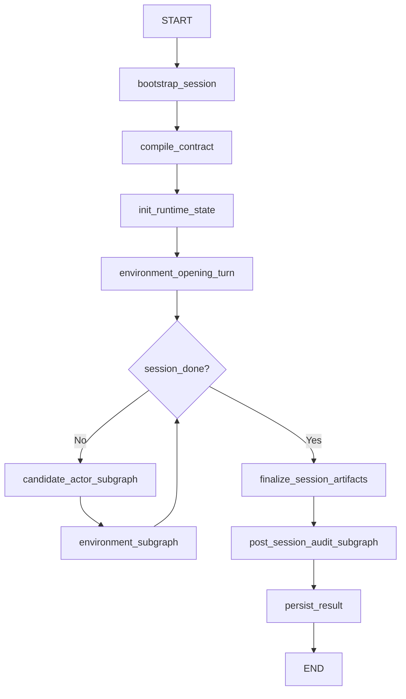
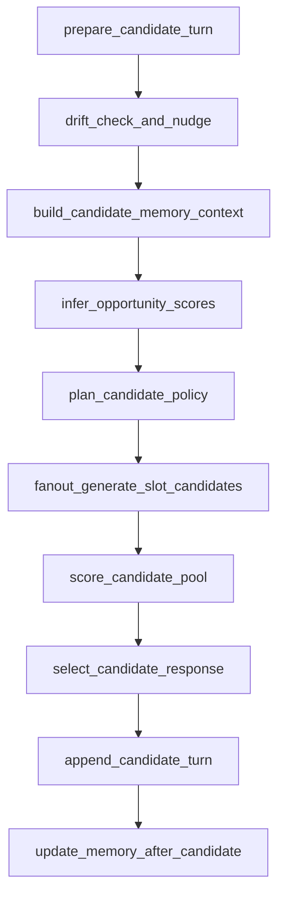
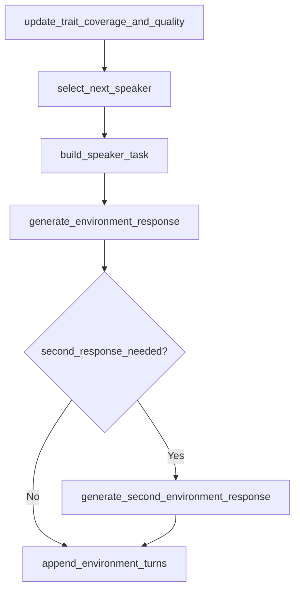
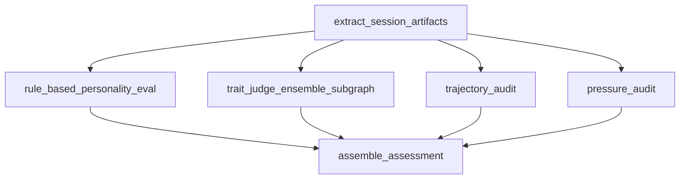
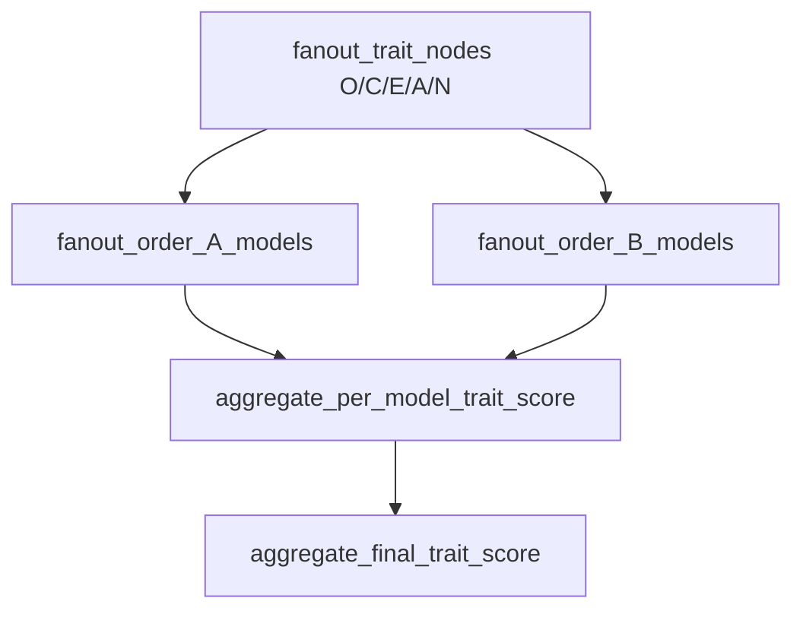

# LangGraph Design for Current BCFC Runtime

Date: 2026-03-06 13:57

## Goal

This document redesigns the current BCFC experiment runtime as a LangGraph-based system.

The goal is not to invent a new algorithm. The goal is to take the current codebase and express it as:

1. a top-level orchestrator graph
2. a candidate-actor subgraph
3. an environment subgraph
4. a post-session audit subgraph

This keeps the current behavior recognizable while making the system more modular, productizable, and model-routable.

## What The Current Code Looks Like

Today the system is logically modular but operationally concentrated in a few large boxes.

- `BatchRunner` owns most orchestration and session lifecycle.
- `ExperimentCandidateAgent` contains both latent planning and candidate generation.
- `FidelityController` contains drift checks, hard constraints, candidate scoring, and candidate selection.
- `GroupEngine` and `Moderator` manage the environment side of the discussion.
- Post-session evaluation is called after the session loop completes.

This means the code is not truly "one model does everything", but the runtime control flow still feels like one large procedural box.

## Design Principles

The LangGraph design below follows these rules.

1. Keep control, scoring, constraints, and memory updates deterministic where possible.
2. Isolate each LLM call behind a named node with explicit inputs and outputs.
3. Separate online generation from offline evaluation.
4. Keep candidate-side logic and environment-side logic in different subgraphs because they have different objectives.
5. Preserve fan-out / fan-in where it already exists:
   - candidate style-slot generation
   - evaluator model ensemble
6. Keep model routing explicit per node instead of implicit through one shared client.

## Top-Level Graph



## Why The Graph Is Split This Way

- `candidate_actor_subgraph` exists because candidate generation has its own planning, scoring, and memory-aware selection loop.
- `environment_subgraph` exists because the Alex/Jordan/Riley side is already an implicit multi-agent system with a different objective: trait elicitation, not trait preservation.
- `post_session_audit_subgraph` exists because it is expensive, ensemble-heavy, and should not block the online path in a product system.

This is the cleanest mapping from current code to a graph without inventing a new architecture.

## Shared Graph State

The graph should carry a typed runtime state. A practical shape is:

```python
class BCFCGraphState(TypedDict, total=False):
    session_spec: dict
    scenario: dict
    contract: dict
    turns: list
    current_phase_index: int
    turns_in_current_phase: int
    candidate_turn_count: int
    current_nudge: str | None
    memory: dict
    trait_coverage: dict
    quality_metrics: dict
    opportunity_scores: dict
    activation_mask: dict
    policy_plan: dict
    candidate_slots: list[str]
    candidate_pool: list[dict]
    candidate_scores: list[dict]
    selected_candidate: dict | None
    controller_log: dict
    stats: dict
    features: dict
    rule_based_vector: dict
    llm_assessment: dict
    trajectory_scores: dict
    pressure_metrics: dict
    usage: dict
    persisted_path: str | None
```

The important point is that `policy_plan`, `candidate_pool`, `candidate_scores`, `activation_mask`, and `selection_audit` become first-class graph artifacts rather than transient local variables.

## Candidate Actor Subgraph

This subgraph is the core of the current `bcfc_v4` / `bcfc_v5` behavior.



### Candidate Node Table

| Node | Current code mapping | LLM? | Current model | Recommended product model | Why split |
|---|---|---:|---|---|---|
| `prepare_candidate_turn` | phase/cue/target-trait extraction from `GroupEngine` + `BatchRunner` loop | No | - | - | Makes phase context explicit and testable. |
| `drift_check_and_nudge` | `FidelityController.check_and_nudge()` | No | - | - | Drift control is deterministic and should stay reproducible. |
| `build_candidate_memory_context` | `build_memory_context()` | No | - | - | Memory fetch is state IO, not generation. |
| `infer_opportunity_scores` | `_trait_opportunity_scores()` + `_build_activation_mask()` | No | - | - | Keeps situation gating auditable and separate from planning. |
| `plan_candidate_policy` | `ExperimentCandidateAgent.generate_policy_plan()` | Yes | DeepSeek V3 | Reasoning model, default DeepSeek or Claude Sonnet-class | The latent policy object is a reusable artifact and should not be buried inside generation. |
| `fanout_generate_slot_candidates` | `generate_candidate_pool_styles()` | Yes | DeepSeek V3 | Fast generator, DeepSeek / Gemini Flash-class | This is a natural LangGraph fan-out over style slots. |
| `score_candidate_pool` | `score_candidates_policy()` | No | - | - | Selection quality should remain deterministic and inspectable. |
| `select_candidate_response` | `select_candidate_policy_v5()` | No | - | - | Lexicographic selection is control logic, not an LLM task. |
| `append_candidate_turn` | `engine.submit_candidate_turn()` | No | - | - | Writes canonical turn history and updates phase progression. |
| `update_memory_after_candidate` | `extract_commitments()`, `extract_relationship_signal()`, `memory.update_*()` | No | - | Optional small structured-output model only if heuristic memory is replaced | Current memory extraction is heuristic; keep cheap and deterministic first. |

### Candidate Node Details

#### `prepare_candidate_turn`

Inputs:
- `turns`
- `current_phase_index`
- `scenario.phases`

Outputs:
- `phase_name`
- `phase_style`
- `phase_cues`
- `target_traits`
- `candidate_slots`

Justification:
- Current code recomputes these in the loop.
- In LangGraph they should become explicit state so downstream nodes can be replayed or cached.

#### `drift_check_and_nudge`

Current source:
- `FidelityController.check_and_nudge()`

Function:
- Checks recent incremental features against the persona contract.
- Produces a prompt nudge if drift exceeds threshold.

Justification:
- This is the control backbone of BCFC.
- It must remain deterministic or the system loses reproducibility and experiment comparability.

#### `build_candidate_memory_context`

Current source:
- `build_memory_context()` in `memory_backend.py`

Function:
- Produces open commitments and relationship signals for the current turn.

Justification:
- This is a state assembly node, not a reasoning node.
- Splitting it out makes memory failures visible without blaming the planner or generator.

#### `infer_opportunity_scores`

Current source:
- `_trait_opportunity_scores()`
- `_build_activation_mask()`

Function:
- Computes whether O/C should be active in the current context.

Justification:
- This is the most sensitive part of `v5`.
- It should be separated from the planner because it is currently heuristic, stable, and directly debuggable.
- If `v5` fails, this is one of the first nodes to inspect.

#### `plan_candidate_policy`

Current source:
- `ExperimentCandidateAgent.generate_policy_plan()`

Function:
- Produces a compact latent plan with:
  - `stance`
  - `goal_mode`
  - `planning_depth`
  - `novelty_move`
  - `social_tactic`
  - `risk_posture`
  - `memory_focus`

Current model:
- DeepSeek V3 via the default `gen_client`

Recommended model:
- Keep a reasoning-capable model here.
- If cost matters: DeepSeek V3 is acceptable.
- If planning quality becomes unstable: move only this node to a stronger planner model.

Justification:
- Planner output is a compact schema artifact.
- This node should be independently logged, compared, and A/B tested.
- A planner is not the same thing as a surface-text generator.

#### `fanout_generate_slot_candidates`

Current source:
- `generate_candidate_pool_styles()`
- internally calls `generate_response()`

Function:
- Fan out across style slots such as `ideator`, `planner`, `challenger`, `integrator`.
- Reuse the same latent `policy_plan`.
- Produce multiple textual candidates in parallel.

Current model:
- DeepSeek V3

Recommended model:
- A fast generator model
- Keep it cheaper than the planner

LangGraph pattern:
- Use `Send("generate_slot_candidate", slot_payload)` and fan-in the results.

Justification:
- This is the cleanest parallelizable section in the current system.
- It becomes easy to route different slots to different models later.

#### `score_candidate_pool`

Current source:
- `FidelityController.score_candidates_policy()`

Function:
- Scores candidates on:
  - policy match
  - situational adequacy
  - commitment continuity
  - trait evidence
  - relationship consistency
  - trait execution
  - redundancy penalty

Justification:
- This must remain deterministic so selection regressions can be reproduced exactly.
- If an LLM scores here, measurement and control become entangled.

#### `select_candidate_response`

Current source:
- `select_candidate_policy_v5()`

Function:
- Stage A: adequacy gate
- Stage B: minimize activation-weighted contract distance
- Stage C: tie-break by relevance / redundancy / policy-act completion

Justification:
- This is orchestration policy.
- It should remain inspectable and not be hidden inside the generator model.

#### `append_candidate_turn`

Current source:
- `GroupEngine.submit_candidate_turn()`

Function:
- Appends the selected candidate turn
- Updates candidate stats
- Updates moderator quality metrics
- Updates trait coverage
- Advances phase if needed

Important note:
- In the current experiment, the candidate is also simulated.
- In a product with a human user, this node stays and only the upstream candidate-generation subgraph is replaced by `await_user_input`.

#### `update_memory_after_candidate`

Current source:
- `extract_commitments()`
- `extract_relationship_signal()`
- memory backend update methods

Function:
- Updates structured memory after the candidate turn is committed.

Justification:
- Memory updates should happen after selection, not before.
- This guarantees memory tracks actual emitted behavior, not discarded candidates.

## Environment Subgraph

The environment is already implicitly multi-agent.

Today this logic is spread across `GroupEngine`, `Moderator`, `TraitElicitationSelector`, and the individual group agents.



### Environment Node Table

| Node | Current code mapping | LLM? | Current model | Recommended product model | Why split |
|---|---|---:|---|---|---|
| `environment_opening_turn` | `GroupEngine.generate_opening()` | Yes | DeepSeek V3 | Fast generator | Opening is a one-off environment action and can fail independently. |
| `update_trait_coverage_and_quality` | `Moderator.record_candidate_turn()` + `analyze_candidate_traits()` | Yes, partially | DeepSeek V3 for trait analysis | Small structured-output model | Coverage analysis is a different job from dialogue generation. |
| `select_next_speaker` | `TraitElicitationSelector.select_next_speaker()` | No | - | - | Speaker choice is policy logic, not generation. |
| `build_speaker_task` | `Moderator.dispatch_turn()` task assembly | No | - | - | Makes elicitation objective explicit. |
| `generate_environment_response` | `Moderator._dispatch_to_agent()` -> `GroupAgent.generate_response()` | Yes | DeepSeek V3 | Cheaper fast model, unless realism quality requires stronger | Environment agents are distinct voices and should be isolated from candidate logic. |
| `generate_second_environment_response` | `GroupEngine.generate_ai_response()` optional second-turn logic | Yes | DeepSeek V3 | Same as environment response model | Optional branch should not complicate the main response node. |
| `append_environment_turns` | `GroupEngine.generate_ai_response()` append phase | No | - | - | Makes turn history updates explicit. |

### Environment Model Notes

Current code uses the same generation client for:
- candidate planning
- candidate generation
- environment agent generation
- moderator trait analysis

That is serviceable for experiments but not ideal for production.

Recommended product routing:

- `update_trait_coverage_and_quality`: small structured-output model
- `generate_environment_response`: fast low-cost model
- `plan_candidate_policy`: stronger reasoning model
- `fanout_generate_slot_candidates`: fast model

This is one of the biggest practical benefits of moving to LangGraph.

## Post-Session Audit Subgraph

This subgraph should be logically separate from runtime generation.

For product use, it should usually run async after the session turn loop.



### Audit Node Table

| Node | Current code mapping | LLM? | Current model | Recommended product model | Why split |
|---|---|---:|---|---|---|
| `extract_session_artifacts` | session stats + feature extraction | No | - | - | Shared preprocessing for all audits. |
| `rule_based_personality_eval` | `evaluate_rule_based()` | No | - | - | This is the deterministic counterweight to LLM judging. |
| `trait_judge_ensemble_subgraph` | `evaluate_group_session()` / `TraitEvaluator.evaluate_ensemble()` | Yes | DeepSeek + Gemini + Grok + Claude Haiku + GPT-4o-mini | Keep ensemble | High-cost and slow; should be isolated from online runtime. |
| `trajectory_audit` | `evaluate_trajectory()` | Yes | same ensemble client | smaller ensemble or 2-model committee | Separate quality dimension, separate latency budget. |
| `pressure_audit` | `evaluate_perceived_pressure()` | Yes | same ensemble client | smaller ensemble or 2-model committee | Different task from personality judging. |
| `assemble_assessment` | result assembly in `BatchRunner` | No | - | - | Final aggregation should be deterministic. |

### Trait Judge Ensemble Subgraph

This subgraph is itself a graph inside the audit layer.

Current behavior:
- evaluate each trait in parallel
- for each trait, send order A and order B prompts
- for each order, send prompts to the ensemble models in parallel
- aggregate per-model median
- then aggregate final trait median

This is already graph-shaped, but it is implemented today inside one evaluator class.

Suggested explicit LangGraph representation:



Justification:
- this makes evaluator variance visible at the graph level
- escalation rules become a normal graph branch instead of hidden evaluator internals

## Model Routing Summary

### Current code equivalent

| Area | Model assignment today |
|---|---|
| Candidate planner | DeepSeek V3 |
| Candidate generator | DeepSeek V3 |
| Environment agents | DeepSeek V3 |
| Moderator real-time trait analysis | DeepSeek V3 |
| Personality judge | 5-model ensemble: DeepSeek, Gemini Flash, Grok Fast, Claude Haiku, GPT-4o-mini |
| Trajectory audit | same ensemble mechanism |
| Pressure audit | same ensemble mechanism |

### Recommended LangGraph routing

| Node family | Recommended model posture |
|---|---|
| Planner nodes | reasoning-capable model |
| Candidate generation nodes | fast generator |
| Environment actor nodes | fast generator |
| Coverage / summarization nodes | small structured-output model |
| Deterministic control nodes | no LLM |
| Final personality judge | ensemble |
| Async quality audit | smaller committee or ensemble depending budget |

## Why These Nodes Are Separated

### 1. Planner and generator should not be the same node

Reason:
- They solve different problems.
- Planner decides intent.
- Generator realizes surface form.

Benefit:
- You can improve planning without changing style diversity.
- You can swap generator models without losing plan observability.

### 2. Opportunity gating should not be hidden inside the planner

Reason:
- It is currently heuristic and one of the main failure points of `v5`.
- If it is embedded in the planner prompt, debugging becomes opaque.

Benefit:
- You can compare raw opportunity, activation mask, and downstream candidate behavior.

### 3. Scoring and selection should remain deterministic

Reason:
- This is the core scientific control layer.
- If LLMs decide selection, selection regressions become hard to reproduce.

Benefit:
- Better experiment reproducibility
- Better production safety

### 4. Environment and candidate are different subgraphs

Reason:
- Candidate side tries to preserve assigned persona.
- Environment side tries to elicit behavior from the candidate.

Benefit:
- Different model choices
- Different telemetry
- Easier reuse for human-user products

### 5. Audit must be async-capable

Reason:
- The ensemble judge is expensive and slow.
- Product latency should not depend on full psychometric post-hoc evaluation.

Benefit:
- Runtime path becomes cheaper and more stable.
- Audit can scale independently.

## What Should Stay Deterministic

These nodes should not become LLM agents.

- `compile_contract`
- `drift_check_and_nudge`
- `build_candidate_memory_context`
- `infer_opportunity_scores`
- `score_candidate_pool`
- `select_candidate_response`
- `select_next_speaker`
- `rule_based_personality_eval`
- `assemble_assessment`
- `persist_result`

Reason:
- These nodes are policy, validation, state IO, or reproducibility-critical control.

## Suggested Implementation Order

### Phase 1: Graphify without changing behavior

- Create top-level graph
- Create `candidate_actor_subgraph`
- Create `environment_subgraph`
- Keep all current model assignments
- Keep all current heuristics

Success condition:
- same outputs as current system within expected stochastic variance

### Phase 2: Move audit out of the online path

- Create `post_session_audit_subgraph`
- Make it callable async
- Persist intermediate runtime state before audit

Success condition:
- session loop can finish even if audit is delayed or retried later

### Phase 3: Add explicit model routing

- Planner model separate from generator model
- Coverage-analysis model separate from environment generation model
- Keep deterministic controller untouched

Success condition:
- cheaper runtime and cleaner per-node metrics

### Phase 4: Add product-only branches

- replace `candidate_actor_subgraph` with `await_human_input` for user-facing product
- keep the same environment and audit subgraphs

Success condition:
- one graph framework supports both simulation and product runtime

## Bottom Line

The right LangGraph design for this repo is not "many LLM agents everywhere".

The right design is:

- one top-level orchestrator
- one candidate-control subgraph
- one environment subgraph
- one audit subgraph
- deterministic control nodes wherever the current system already has stable logic
- explicit LLM nodes only where the current code is already using generation or judgment

That preserves the scientific structure of BCFC while making the system much easier to operate as a product.
