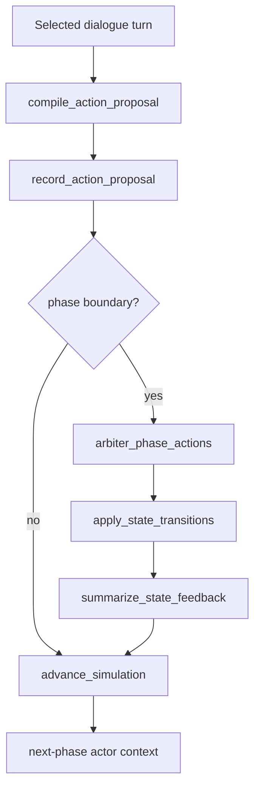

# 2026-03-07 Action Layer v0

## Why This Exists
현재 `simulation_engine`은 `persona-stable dialogue`까지는 검증됐다. 다음 제품 리스크는 `대화가 실제 행동과 환경 상태 변화로 이어질 때도 persona stability와 trajectory consistency가 유지되는가`다.  
Action Layer v0의 목적은 현재 엔진을 `dialogue -> typed action -> phase-end state transition -> next-phase feedback` 루프로 확장하고, 이 루프가 `prompt-only baseline`보다 더 구조화된 action과 더 안정적인 world-state trajectory를 만드는지 검증하는 것이다.

v0에서는 Graphiti/Neo4j를 도입하지 않는다. 지금 필요한 것은 복잡한 graph retrieval이 아니라, 작고 감사 가능한 typed action과 deterministic transition이다.

## Current Repo Leverage
Action Layer v0는 기존 코드를 최대한 재사용한다.

- `SimulationScript`는 이미 actor, phase, event contract를 갖고 있었다. 이제 여기에 `world_state_schema`, `initial_world_state`, `allowed_action_types`, `transition_rules`, `state_visibility_rules`를 추가했다. [/Users/pjihae/Documents/GitHub/UbeU_V2/simulation_engine/script.py](/Users/pjihae/Documents/GitHub/UbeU_V2/simulation_engine/script.py)
- `SimulationStateLedger`는 기존 turn/relationship/commitment store였다. 이제 여기에 `action_proposals`, `executed_actions`, `world_state_history`, `phase_state_feedback`를 authoritative state로 추가했다. [/Users/pjihae/Documents/GitHub/UbeU_V2/simulation_engine/state_ledger.py](/Users/pjihae/Documents/GitHub/UbeU_V2/simulation_engine/state_ledger.py)
- `StakeholderActor`는 기존 planner/generator를 재사용한다. 여기에 world state, local state, recent executed actions, unresolved actions를 hidden context로 주입하고, planner output에 `action_intent`, `target_state_key`, `commitment_strength`, `expected_state_effect`를 보강한다. [/Users/pjihae/Documents/GitHub/UbeU_V2/simulation_engine/actor.py](/Users/pjihae/Documents/GitHub/UbeU_V2/simulation_engine/actor.py)
- `PersonaStateController`는 기존 persona stability selector다. `engine_action_v0`에서만 `action_executability`와 `state_consistency`를 추가 점수로 쓴다. [/Users/pjihae/Documents/GitHub/UbeU_V2/simulation_engine/controller.py](/Users/pjihae/Documents/GitHub/UbeU_V2/simulation_engine/controller.py)
- `LangGraph runtime`는 기존 turn loop에 `compile_action_proposal -> record_action_proposal -> arbiter_phase_actions -> apply_state_transitions -> summarize_state_feedback` 노드를 추가했다. [/Users/pjihae/Documents/GitHub/UbeU_V2/simulation_engine/graphs.py](/Users/pjihae/Documents/GitHub/UbeU_V2/simulation_engine/graphs.py)

## Architecture

핵심 선택은 다음이다.

- 액션 적용 시점: `phase-end`
- 시나리오 범위: `현재 policy + non-policy 전체`
- benchmark 비교 구조: `3-arm`
- 저장소: `in-memory / JSON ledger`
- graph DB: `v0 제외`, future backend interface만 추가

이 선택을 한 이유는 두 가지다.

1. phase-end apply가 더 감사 가능하다. turn마다 바로 상태를 바꾸면 어떤 발화가 어떤 전이를 만들었는지 디버깅이 어려워진다.
2. v0의 목표는 “복잡한 world simulation”이 아니라 “action-conditioned consistency”다. 따라서 자유 행동 전체를 허용하는 대신 typed action ontology로 제한하는 것이 맞다.

## Types And Interfaces

### Action Types
v0 action ontology는 아래 8개로 고정했다.

- `assign_owner`
- `request_evidence`
- `publish_update`
- `narrow_scope`
- `pilot`
- `commit_resource`
- `defer_decision`
- `preserve_autonomy`

이걸 작게 고정한 이유는 action parse 안정성과 deterministic transition rule 작성 가능성을 우선했기 때문이다.

### New Authoritative Types
구현 위치: [/Users/pjihae/Documents/GitHub/UbeU_V2/simulation_engine/action_layer.py](/Users/pjihae/Documents/GitHub/UbeU_V2/simulation_engine/action_layer.py)

- `ActionProposal`
  - turn에서 추출된 typed action 후보
  - `status`: `proposed`, `approved`, `rejected`, `executed`
- `ExecutedAction`
  - 실제로 world state에 적용된 액션
  - `pre_state`, `post_state`, `applied_delta`를 같이 저장
- `WorldStateSnapshot`
  - phase-end world snapshot
  - `global_state`, `local_state_by_actor`, `executed_action_ids`
- `TransitionRule`
  - hand-authored deterministic state transition contract

### State Store
구현 위치: [/Users/pjihae/Documents/GitHub/UbeU_V2/simulation_engine/state_store.py](/Users/pjihae/Documents/GitHub/UbeU_V2/simulation_engine/state_store.py)

- `StateStore` protocol 추가
- `InMemoryStateStore`만 구현
- `GraphStateStore`는 intentionally deferred

이 인터페이스를 지금 넣은 이유는, v0에서는 graph DB를 쓰지 않지만 이후 backend swap 지점을 미리 고정하기 위해서다.

## World State Design
모든 시나리오의 공통 global state는 아래 5개다.

- `alignment`
- `trust`
- `uncertainty`
- `execution_confidence`
- `risk`

시나리오별 추가 state:

- policy
  - `admin_feasibility`
  - `spillover_risk`
- `new_product_launch`
  - `launch_readiness`
  - `message_alignment`
  - `incident_risk`
- `post_merger_integration`
  - `retention_risk`
  - `autonomy_confidence`
  - `integration_clarity`

delta palette는 고정했다.

- `low = 0.04`
- `medium = 0.08`
- `high = 0.12`

transition rule은 학습형이 아니라 hand-authored deterministic rule이다. 현재 script loader가 각 시나리오에 맞는 schema와 transition rule을 자동으로 주입한다. [/Users/pjihae/Documents/GitHub/UbeU_V2/simulation_engine/manual_scripts.py](/Users/pjihae/Documents/GitHub/UbeU_V2/simulation_engine/manual_scripts.py)

## Action Compiler
구현 위치: [/Users/pjihae/Documents/GitHub/UbeU_V2/simulation_engine/action_layer.py](/Users/pjihae/Documents/GitHub/UbeU_V2/simulation_engine/action_layer.py)

v0 action compiler는:

- 1차: heuristic parse
- 2차: 필요한 경우에만 `LLM JSON extraction`
- 마지막: deterministic validation

으로 동작한다.

validator는 아래를 확인한다.

- `allowed_action_types`
- `target_key`가 `world_state_schema` 안에 있는지
- `owner_actor_id`, `target_actor_id` 유효성
- `deadline_phase` 유효성

free-form regeneration은 하지 않는다. 이건 비용과 variance를 억제하기 위한 선택이다.

## State Feedback
다음 phase actor context에는 긴 world log를 넣지 않는다. actor는 아래만 본다.

- `world_state_line`
- `local_state_line`
- `last_actions_line`
- 자기 unresolved action

이렇게 한 이유는 persona-context flooding을 막기 위해서다. Action feedback을 늘릴수록 persona drift가 커질 위험이 있기 때문에, v0는 summary-only로 제한했다.

## Benchmark Conditions

| Condition | Dialogue | Action compile | Phase-end apply | State feedback | Action-aware scoring |
|---|---|---|---|---|---|
| `naive_action_baseline` | naive | yes | yes | yes | no |
| `engine_dialogue_only` | current `engine_controller` dialogue stack | yes | yes | yes | no |
| `engine_action_v0` | current `engine_controller` + action-aware planner/controller | yes | yes | yes | yes |

세 조건 모두 동일한 transition engine과 state feedback loop를 공유한다. 차이는 dialogue generation과 scoring뿐이다. 이 구조로 가야 Action Layer 자체의 효과를 분리할 수 있다.

## KPI Table

| KPI | 정의 | 기대 방향 | v0 Pass 기준 |
|---|---|---|---|
| `structured_action_validity_rate` | action-bearing turns 중 schema-valid proposal 비율 | 증가 | `engine_action_v0 >= 0.85` and `>= naive + 0.15` |
| `owner_resolution_rate` | executed actions 중 owner가 채워진 비율 | 증가 | `>= 0.80` |
| `executed_action_contradiction_rate` | 동일 actor/target trajectory 내 상반된 executed action 비율 | 감소 | `<= 0.05` and `<= naive * 0.5` |
| `state_transition_coherence` | 승인된 전이가 deterministic rule과 precondition을 만족한 비율 | 증가 | `>= 0.90` |
| `state_trajectory_variance` | 반복 실행 시 phase-end world state variance 평균 | 감소 | `<= naive - 20%` |
| `action_feedback_utilization` | 다음 phase turn이 action/state feedback을 반영한 비율 | 증가 | `>= 0.60` |
| `persona_drift_mae_after_action` | action feedback 포함 후 persona drift | 유지/개선 | current `engine_controller` 대비 `+0.01` 이상 악화 금지 and `< naive` |
| `relationship_inconsistency_after_action` | action feedback 포함 후 관계 불안정성 | 감소 | `< naive` |
| `commitment_contradiction_after_action` | action feedback 포함 후 commitment contradiction | 감소 | `<= naive * 0.5` |

구현된 metrics 위치: [/Users/pjihae/Documents/GitHub/UbeU_V2/simulation_engine/metrics.py](/Users/pjihae/Documents/GitHub/UbeU_V2/simulation_engine/metrics.py)

## Baseline Experiment Design

### Smoke
- `commuting_support_policy`
- `new_product_launch`
- 각 condition `1 repetition`

### Full
- 현재 5개 script 전체
- 각 condition `3 repetitions`

### Stress
- `housing_support_policy`
- `post_merger_integration`
- 각 condition `5 repetitions`

stress 단계는 hardest-role archetype을 보기 위한 것이다.

- `Small property owner`
- `Operations and reliability lead`
- `Acquired company founder`

## Why Graphiti / Neo4j Is Deferred
v0에서 graph DB를 제외한 이유는 기술적으로 명확하다.

- actor 수가 아직 작다
- horizon이 짧다
- 필요한 것은 temporal graph query보다 deterministic state transition이다
- 현재 병목은 memory retrieval이 아니라 `action/state coherence`다

graph backend를 재검토할 조건은 다음으로 고정한다.

- actor 수 `>= 8`
- 시뮬레이션 horizon `>= 6 phases`
- multi-hop temporal query가 제품 요구가 됨
- JSON ledger로 debugging/querying이 어려워짐

## Implementation Notes
Action Layer v0는 이미 아래 파일에 구현돼 있다.

- [/Users/pjihae/Documents/GitHub/UbeU_V2/simulation_engine/action_layer.py](/Users/pjihae/Documents/GitHub/UbeU_V2/simulation_engine/action_layer.py)
- [/Users/pjihae/Documents/GitHub/UbeU_V2/simulation_engine/script.py](/Users/pjihae/Documents/GitHub/UbeU_V2/simulation_engine/script.py)
- [/Users/pjihae/Documents/GitHub/UbeU_V2/simulation_engine/state_ledger.py](/Users/pjihae/Documents/GitHub/UbeU_V2/simulation_engine/state_ledger.py)
- [/Users/pjihae/Documents/GitHub/UbeU_V2/simulation_engine/actor.py](/Users/pjihae/Documents/GitHub/UbeU_V2/simulation_engine/actor.py)
- [/Users/pjihae/Documents/GitHub/UbeU_V2/simulation_engine/controller.py](/Users/pjihae/Documents/GitHub/UbeU_V2/simulation_engine/controller.py)
- [/Users/pjihae/Documents/GitHub/UbeU_V2/simulation_engine/graphs.py](/Users/pjihae/Documents/GitHub/UbeU_V2/simulation_engine/graphs.py)
- [/Users/pjihae/Documents/GitHub/UbeU_V2/simulation_engine/benchmark.py](/Users/pjihae/Documents/GitHub/UbeU_V2/simulation_engine/benchmark.py)
- [/Users/pjihae/Documents/GitHub/UbeU_V2/simulation_engine/metrics.py](/Users/pjihae/Documents/GitHub/UbeU_V2/simulation_engine/metrics.py)
- [/Users/pjihae/Documents/GitHub/UbeU_V2/simulation_engine/reporting.py](/Users/pjihae/Documents/GitHub/UbeU_V2/simulation_engine/reporting.py)

## Citations
- Park et al. 2023, *Generative Agents: Interactive Simulacra of Human Behavior*. [arXiv](https://arxiv.org/abs/2304.03442)
- Yao et al. 2023, *ReAct: Synergizing Reasoning and Acting in Language Models*. [arXiv](https://arxiv.org/abs/2210.03629)
- Bhandari et al. 2025, *Can LLM Agents Maintain a Persona in Discourse?* [ACL Anthology](https://aclanthology.org/2025.emnlp-main.1487/)
- Zhang et al. 2025, *SPARK: Simulating the Co-evolution of Stance and Topic Dynamics in Online Discourse with LLM-based Agents*. [ACL Anthology](https://aclanthology.org/2025.emnlp-main.1176/)
- Li and Tao 2026, *Position: AI Agents Are Not (Yet) a Panacea for Social Simulation*. [arXiv](https://arxiv.org/abs/2603.00113)
