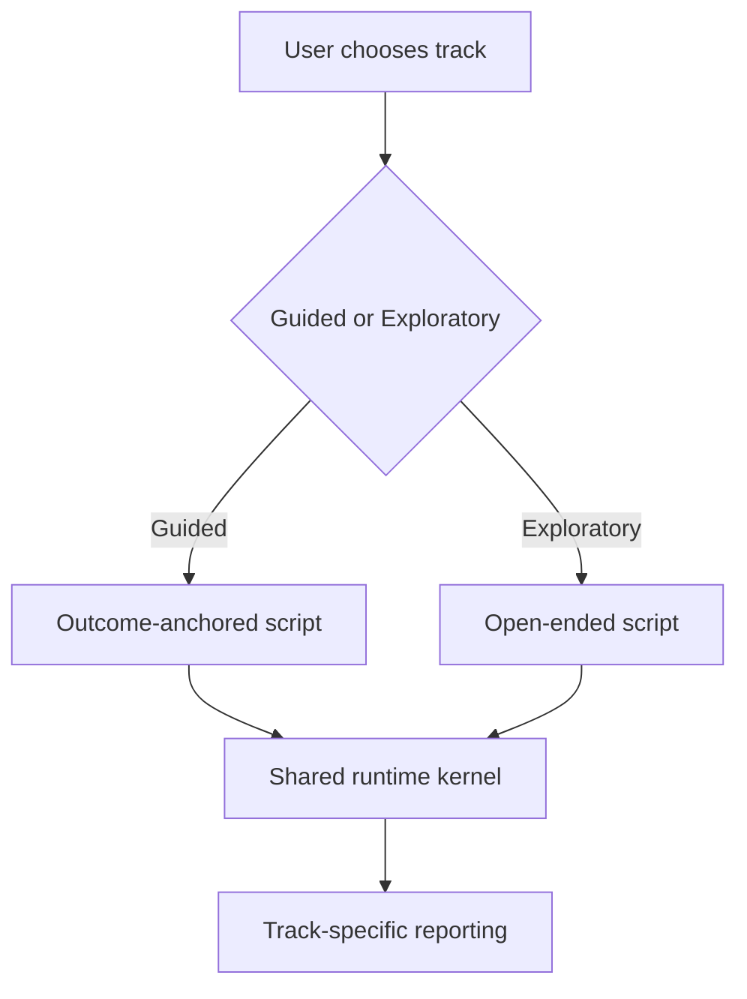

# 2026-03-08 Two-Track Simulation Plan

## Why This Exists

현재 실험 결과는 하나의 중요한 tradeoff를 보여준다.

- `engine_dialogue_only`는 `naive_action_baseline`보다 persona stability와 interaction consistency가 확실히 좋다.
- 하지만 action family convergence가 높고 role action diversity가 낮다.

즉 현재 runtime은 `guided / outcome-anchored` pressure test에는 잘 맞지만, `exploratory / open-ended` simulation에는 그대로 쓰기 어렵다.

그래서 다음 제품 단계는 하나의 UX로 모든 simulation을 덮는 것이 아니라,

1. `guided` track
2. `exploratory` track

으로 분리하는 것이다.

## Research Basis

이 분리는 futures/scenario planning 쪽의 고전적 구분과 맞다.

- `exploratory scenarios`는 “무슨 일이 일어날 수 있는가”를 본다.
- `normative / backcasting scenarios`는 “어떤 결과를 원하며 거기로 가려면 무엇이 필요한가”를 본다.

관련 근거:
- Börjeson et al., *Scenario types and techniques: Towards a user’s guide*, Futures (2006). exploratory vs normative scenario distinction.
- Quist & Vergragt, *Past and future of backcasting* (2006). desired future state를 정하고 경로를 거꾸로 설계하는 방식.
- Park et al., [Generative Agents](https://arxiv.org/abs/2304.03442). memory/planning/reflection이 emergent social behavior를 만들지만, explicit environment contract가 필요하다는 근거.
- Bhandari et al., [Can LLM Agents Maintain a Persona in Discourse?](https://aclanthology.org/2025.emnlp-main.1487/). multi-turn interaction에서 persona drift guard가 필요하다는 근거.
- Li & Tao, [Position: AI Agents Are Not (Yet) a Panacea for Social Simulation](https://arxiv.org/abs/2603.00113). explicit environment, exposure, scheduling이 없으면 agent simulation이 쉽게 붕괴한다는 근거.

## Product Interpretation

### Guided Track

목적:
- 특정 목표/결말/guardrail이 있을 때
- 그 경로에서 어느 stakeholder interaction이 깨지는지 보는 것

적합 사례:
- 정책 도입 pressure test
- 신제품 출시 readiness
- PMI integration decision

핵심 UX:
- user가 `desired outcome`, `non-negotiable constraints`, `success criteria`를 넣는다
- engine은 그 목표를 향해 stakeholder dynamics를 pressure-test한다

핵심 KPI:
- persona drift
- envelope violations
- commitment contradiction
- outcome attainment
- action coherence

### Exploratory Track

목적:
- 결말을 정하지 않고
- pressure 하에서 stakeholder가 어떤 경로로 갈라지는지 보는 것

적합 사례:
- brand crisis
- resource scarcity reallocation
- community conflict

핵심 UX:
- user는 scenario brief와 key stakeholder만 준다
- engine은 가능한 반응 패턴과 갈등 축, branch를 보여준다

핵심 KPI:
- persona drift
- relationship inconsistency
- trajectory diversity
- role action diversity
- negotiation uniqueness
- branch plausibility

## Architecture

공통인 것:
- `StakeholderActor`
- `PersonaStateController`
- `SimulationStateLedger`
- `LangGraph runtime`

달라지는 것:
- `simulation_mode`
- `scenario_family`
- `outcome_spec`
- KPI와 pass criteria

## Implementation Strategy

### Phase 1. Contract Lift

`SimulationScript`에 아래 필드를 추가한다.

- `simulation_mode`: `guided | exploratory`
- `scenario_family`
- `outcome_spec`

이 필드는 이미 제품에서 future builder layer가 채워줄 자리다.

### Phase 2. Manual Scenario Expansion

기존 5개 guided script 유지.

새 exploratory pressure scripts 추가:
- `brand_crisis_response`
- `resource_reallocation_crunch`

### Phase 3. Benchmark Split

benchmark/reporting이 아래 단위로 aggregate 하도록 한다.
- by script
- by family
- by mode

즉 앞으로는 guided와 exploratory를 한 평균으로 섞어 해석하지 않는다.

### Phase 4. Mode-Specific Runtime Policies

guided 기본값:
- 낮은 contradiction
- 높은 commitment continuity
- action coherence 우선

exploratory 기본값:
- 높은 diversity allowance
- 낮은 duplicate penalty
- role-differentiated branching 우선

중요:
- controller를 새로 만드는 것이 아니라
- `SimulationScript` metadata가 controller policy를 parameterize한다.

## Immediate Code Changes

1. `simulation_engine/script.py`
- `simulation_mode`, `scenario_family`, `outcome_spec` 추가

2. `simulation_engine/runtime.py`
- runtime summary에 mode/family/outcome 정보 포함

3. `simulation_engine/benchmark.py`
- `aggregate_by_mode`, `aggregate_by_family` 추가

4. `simulation_engine/reporting.py`
- mode/family summary 출력

5. `simulation_engine/manual_scripts.py`
- guided family metadata 추가
- exploratory pressure scripts 추가

## Next Experiments

### Guided Regression
- current 5 guided scripts
- `naive_action_baseline` vs `engine_dialogue_only`
- guided KPI 유지 확인

### Exploratory Smoke
- `brand_crisis_response`
- `resource_reallocation_crunch`
- `naive_action_baseline` vs `engine_dialogue_only`
- exploratory KPI baseline 확보

### Decision Gate

guided와 exploratory 둘 다 최소 signal이 나오면,
- builder layer에서 mode 선택 UX를 구현

한쪽이 약하면,
- shared kernel은 유지
- track-specific policy만 따로 다듬는다

## What Not To Do Yet

- actor 수를 바로 10명으로 올리지 않는다
- Graphiti/Neo4j를 아직 붙이지 않는다
- dynamic builder layer를 지금 바로 구현하지 않는다

이것들은 `mode/family contract`와 exploratory benchmark가 안정된 뒤의 문제다.

## Implementation Status (2026-03-08)

이번 구현 단계에서 실제로 반영한 것은 아래다.

- `guided reliability`
  - fallback taxonomy 분리
    - `timeout_fallback`
    - `retry_exhausted_fallback`
    - `non_transient_fallback`
    - `empty_pool_fallback`
  - benchmark aggregate에 `clean_run_count`, `contaminated_run_count`, clean-only summary 추가
  - hotspot family에서 phase별 `style_slot_limit`, `pool_max_concurrency`, `planner_cache`를 script metadata로 제어
  - candidate pool은 fallback slot이 있어도 surviving candidate가 있으면 계속 진행
- `exploratory diversity`
  - `phase_action_policies`와 `actor_action_preferences`를 script metadata로 승격
  - exploratory negotiation에서 `family_cap`, `max_same_family_per_phase`, `uniqueness_bonus`, `duplicate_penalty`를 metadata로 제어
  - action arbitration이 family cap과 actor preference를 실제 승인 단계에 반영

이 선택은 두 방향을 따른다.
- guided는 contamination gate를 먼저 통과시키는 쪽
- exploratory는 same-phase convergence를 승인 단계에서 줄이는 쪽

이건 adaptive communication/compute와 explicit role differentiation을 강화하는 방향으로, [Wang et al., 2025](https://aclanthology.org/2025.emnlp-main.584/), [Wang et al., 2025](https://aclanthology.org/2025.acl-long.1170/), [Zeng et al., 2025](https://aclanthology.org/2025.naacl-long.475/), [Li et al., 2025](https://aclanthology.org/2025.acl-long.1105/)와 정합적이다.
