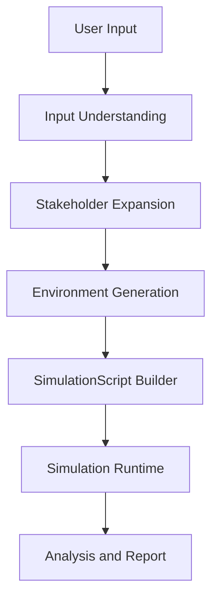

# Dynamic Simulation Plan

## Purpose
이 문서는 현재 구현된 `simulation_engine`의 다음 제품 레이어인

- `input understanding`
- `stakeholder expansion`
- `environment generation`
- `SimulationScript builder`

를 설계하기 위한 계획 문서다.

중요한 전제는 다음이다.

1. 현재 구현된 runtime/control kernel은 그대로 재사용한다.
2. 새 stakeholder마다 별도 controller를 코딩하지 않는다.
3. dynamic builder layer는 `SimulationScript`를 자동 생성하는 앞단이다.
4. 이 레이어는 지금 당장 구현하지 않고, Action Layer v0 benchmark 이후 단계로 둔다.

## Product Goal
최종 제품은 사용자가 아래 중 하나를 넣으면:

- scenario brief
- report / memo / policy draft
- key stakeholder list

엔진이 자동으로:

1. direct stakeholder를 추출하고
2. indirect stakeholder를 확장하고
3. 각 stakeholder의 identity / incentives / concerns / personality prior를 구성하고
4. phase, world state, action ontology, transition rules를 포함한 `SimulationScript`를 만들고
5. persona/action fidelity controlled simulation을 실행하고
6. 결과 보고서와 risk map을 출력해야 한다.

즉 제품의 핵심은 `LLM roleplay`가 아니라:

- `builder layer`
- `controlled runtime`
- `analysis/report layer`

의 결합이다.

## Current Boundary

### Already Built
현재 repo에 이미 있는 것:

- `StakeholderActorSpec`
- `SimulationScript`
- `SimulationStateLedger`
- `PersonaStateController`
- `StakeholderSimulationRuntime`
- `LangGraph runtime`
- `Action Layer v0`

즉 현재는 `builder output`만 주어지면 simulation을 돌릴 수 있다.

### Not Built Yet
아직 없는 것:

- user input parsing
- stakeholder discovery
- indirect stakeholder expansion
- dynamic world-state schema selection
- dynamic transition-rule selection
- scenario family classification
- HITL edit UI contract

따라서 다음 레이어의 정확한 책임은:

> user input를 받아 runnable `SimulationScript`를 생성하는 것

이다.

## Architecture



### Layer 1. Input Understanding
역할:

- 입력 문서/브리프에서 목적 추출
- 핵심 대상 집단 추출
- 핵심 의사결정 질문 추출
- pressure source 추출
- explicit stakeholder 추출
- uncertainty / missing info tagging

입력 예:

- `"정책 A가 대한민국 20-40대 청년들에게 끼칠 영향"`
- 회사의 신제품 출시 브리프
- M&A integration memo

출력 예:

```json
{
  "domain": "policy",
  "objective": "estimate direct and spillover effects",
  "primary_targets": ["young workers"],
  "seed_stakeholders": ["beneficiaries", "district admin", "adjacent merchants"],
  "pressure_sources": ["budget cap", "administrative friction"],
  "open_questions": ["second-order labor demand effect"]
}
```

### Layer 2. Stakeholder Expansion
역할:

- direct stakeholder에서 indirect stakeholder를 확장
- actor archetype을 배정
- actor마다 identity / incentives / concerns / exposure / resource profile 설정
- relationship prior를 초기화

여기서 중요한 규칙:

- direct만 쓰면 안 된다
- adjacent / institutional / opposing / implementation stakeholders를 최소 1개 이상 고려해야 한다

확장 방식:

1. `direct`
2. `adjacent`
3. `institutional`
4. `opposing`
5. `implementation`

예:
- youth policy
  - direct: young worker
  - adjacent: local merchant
  - institutional: district admin
- new product launch
  - direct: product lead
  - adjacent: marketing lead
  - implementation: ops/reliability lead
- PMI
  - direct: strategy lead
  - opposing/autonomy-sensitive: founder
  - institutional: people/integration lead

### Layer 3. Environment Generation
역할:

- scenario family를 결정
- phase topology 선택
- world-state schema 선택
- action ontology subset 선택
- transition rule family 선택
- event schedule 생성
- visibility rule 생성

핵심은 여기서 모든 걸 자유 생성하지 않는 것이다.

제품적으로는 `scenario family templates`를 먼저 두는 게 맞다.

예상 family:

- `policy_spillover`
- `launch_pressure`
- `integration_trust`
- `resource_scarcity`
- `brand_crisis`

각 family가 정하는 것:

- phase sequence
- 기본 world state keys
- allowed action subset
- transition rule palette

즉 world model은 actor마다 커스텀하는 게 아니라, `scenario family` 기반으로 선택된다.

### Layer 4. SimulationScript Builder
역할:

- 위 세 레이어 결과를 runtime contract로 변환

출력:

- `stakeholders`
- `phases`
- `world_events`
- `world_state_schema`
- `initial_world_state`
- `allowed_action_types`
- `transition_rules`
- `state_visibility_rules`

즉 builder layer의 완성 조건은:

> 사람이 손으로 쓴 `manual_scripts.py`와 유사한 품질의 `SimulationScript`를 자동 생성하는 것

이다.

## Why Control Does Not Need Per-Stakeholder Custom Code
현재 control engine은 actor별 bespoke implementation이 아니라 parameterized runtime이다.

핵심 근거:

- `StakeholderActor`는 `StakeholderActorSpec`을 받아 생성된다.
- `PersonaStateController`는 `actor_spec` 기반으로 인스턴스화된다.
- `SimulationStateLedger`는 actor 수와 spec을 보고 자동 초기화된다.
- `Action Layer`도 script contract 기반이다.

즉 새 stakeholder가 생길 때 필요한 것은:

- 새 controller class
- 새 runtime class

가 아니라,

- 새 `StakeholderActorSpec`
- 적절한 `world_state_schema`
- 적절한 `allowed_action_types`
- 적절한 `transition_rules`

이다.

이게 중요한 이유는 제품 확장성 때문이다. actor마다 controller를 따로 만들면 scale이 불가능해진다.

## Dynamic Builder Contract

### InputUnderstandingOutput
```json
{
  "domain": "policy|strategy|marketing|integration|other",
  "objective": "string",
  "seed_stakeholders": ["string"],
  "pressure_sources": ["string"],
  "direct_effects": ["string"],
  "candidate_spillovers": ["string"],
  "open_questions": ["string"]
}
```

### StakeholderExpansionOutput
```json
{
  "stakeholders": [
    {
      "role": "string",
      "stakeholder_type": "direct|adjacent|institutional|opposing|implementation",
      "identity_core": {},
      "incentives": [],
      "concerns": [],
      "resource_profile": {},
      "relationship_priors": {}
    }
  ]
}
```

### EnvironmentGenerationOutput
```json
{
  "scenario_family": "string",
  "phases": [],
  "world_state_schema": [],
  "initial_world_state": {},
  "allowed_action_types": [],
  "transition_rules": {},
  "world_events": []
}
```

### Final Builder Output
```json
{
  "simulation_script": "SimulationScript"
}
```

## Human-In-The-Loop Edit Points
이 레이어는 완전 자동보다 `human editable`이 제품적으로 더 안전하다.

필수 edit points:

1. stakeholder map
2. role labels
3. incentives / concerns
4. phase topology
5. world events
6. action ontology subset
7. transition rule family

제품 UX에서는 builder가 초안을 만들고, 사람이 수정 승인한 뒤 runtime이 돌아가는 구조가 맞다.

## What Should Stay Generic
generic으로 유지할 것:

- `StakeholderActor`
- `PersonaStateController`
- `SimulationStateLedger`
- `LangGraph runtime`
- `Action Layer`
- benchmark / metrics framework

scenario-family specific으로 관리할 것:

- world-state schema
- allowed action subset
- transition rules
- phase topology
- stakeholder expansion heuristics

즉 generic control engine과 scenario-family templates를 분리하는 게 핵심이다.

## Recommended Implementation Order

### Phase A. Plan Only
지금 단계.

- `dynamicSimulation-PLAN.md` 유지
- runtime/action benchmark 먼저

### Phase B. Minimal Builder v0
구현 범위:

- structured user input -> template selection
- direct stakeholder seed -> fixed heuristics expansion
- family-based `SimulationScript` generation

이 단계에서는:

- uploaded PDF full parsing은 아직 제외
- freeform stakeholder discovery도 제한

### Phase C. Builder v1
구현 범위:

- 문서 ingestion
- direct/indirect stakeholder extraction
- confidence scoring
- uncertainty/caveat generation
- HITL review

### Phase D. Scale / Memory Backend
이 단계에서만 검토:

- actor count 증가
- longer horizon
- graph backend 필요성

## Why This Is Deferred
지금 이 레이어를 바로 구현하지 않는 이유:

1. runtime와 builder failure를 분리해야 한다
2. Action Layer v0가 아직 먼저 검증돼야 한다
3. 지금 builder까지 동시에 만들면 디버깅 경계가 무너진다

즉 현재 우선순위는:

- runtime / action coherence 증명
- 그 다음 builder automation

이다.

## Success Criteria For Future Builder Work
builder layer가 의미 있으려면 아래를 만족해야 한다.

1. 생성된 `SimulationScript`가 manual script와 유사한 quality를 낼 것
2. actor count, role diversity, pressure topology가 plausible할 것
3. runtime KPI가 manual-script benchmark 대비 과도하게 무너지지 않을 것
4. user가 stakeholder map과 environment를 수정 가능할 것

## Immediate Next Step
다음 실제 구현 대상은 아니다.
다음 실제 구현 대상은 여전히:

- Action Layer v0 smoke
- full
- stress benchmark

이 문서는 그 다음 단계의 builder architecture를 고정하는 용도다.
